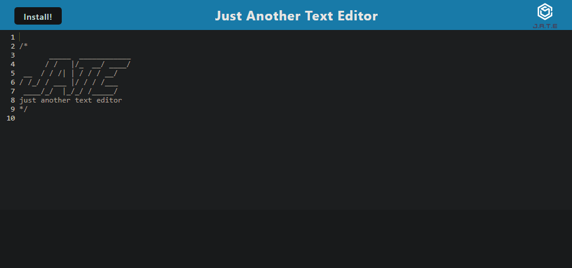
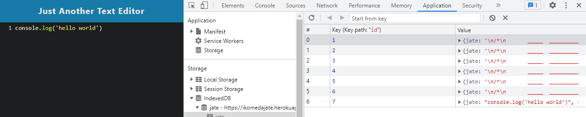

# Text-Editor

### Screenshots

  
  ## License
  
  ## Description
  Just another text editor with pwa functionality
  ## Table of Contents
- [Text-Editor](#text-editor)
    - [Screenshots](#screenshots)
  - [License](#license)
  - [Description](#description)
  - [Table of Contents](#table-of-contents)
  - [Installation](#installation)
  - [Usage](#usage)
  - [Contributions](#contributions)
  - [Test Instructions](#test-instructions)
  - [Contact](#contact)
  ## Installation
  visit the deployed page and click the install button to use at your leisure.
  ## Usage
  Type text in and check the application storage under indexdb to see as it updates your text into a database.
  ## Contributions
  n/a
  ## Test Instructions
  n/a
  ## Contact
  * GitHub: https://github.com/Ikomeda/
  * Email: n/a